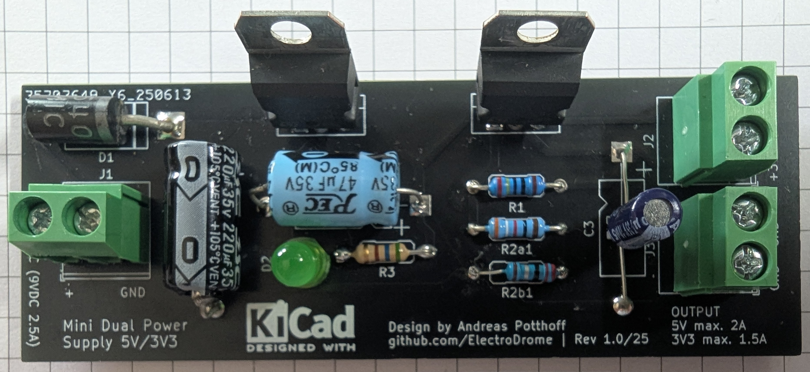
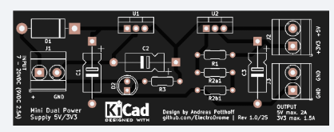
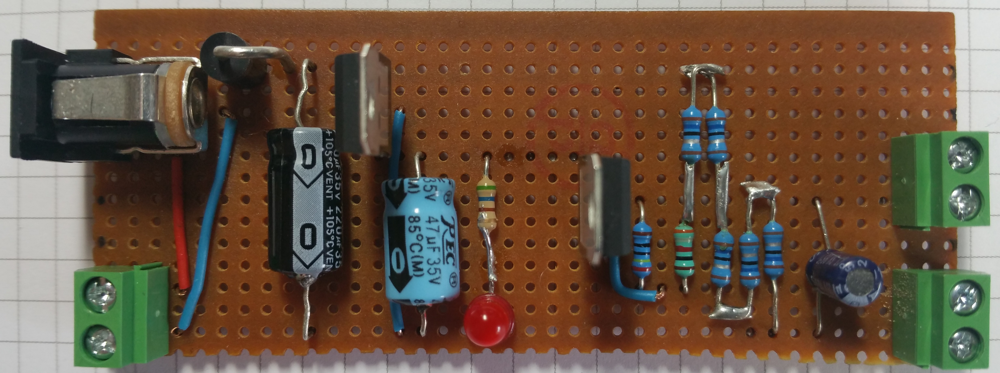

# 🔋 Lab Tool – Mini Dual Power Supply 5V / 3.3V

  

---

## 📦 Project Overview

This compact dual-voltage power supply module provides **regulated 5 V and 3.3 V outputs** from a single 9 V DC input. Designed for breadboard prototyping and embedded development, it features **adjustable voltage regulators**, **reverse polarity protection**, and **low-noise filtering** — all on a single PCB.

---

## 📦 Project Files

- 📄 [Bill of Materials (BOM)](./bom/bom.csv) – Complete list of components and values  
- 🖼️ [Circuit Schematic (PNG)](./img/dual_power_supply1_schematics.png) – Visual overview of the circuit
- 🧪 [Gerber Files](./gerber/dual_power_supply1_gerber.zip) – PCB production files  

---

## 🌟 Features

- ⚡ **Dual output rails**: 5 V (max. 1.5/2 A) and 3.3 V (max. 1.5 A)  
- 🔌 **Input voltage**: 9 V DC / 2.5 A  
- 🔧 **Adjustable regulators** with resistor-calculated output  
- 🔄 **Reverse polarity protection** via diode  
- 🔋 **Low ESR capacitors** for stable output  
- 📐 Compact PCB layout with labeled terminals  
- 🧮 Voltage calculation via LM317 formula: `Vout = 1.25 V × (1 + R2 / R1)`  
- 🔓 Licensed Open Hardware (CERN-OHL and CC-BY-SA)

---

## 🧰 Applications

- Powering microcontrollers and sensors  
- Breadboard prototyping  
- Dual-rail analog circuits  
- Educational electronics labs  
- Low-voltage logic testing

---

## 🔧 Build Specifications

| Attribute         | Value                          |
|------------------|---------------------------------|
| Input Voltage     | 9 V DC / 2.5 A  
| Output Voltage    | 5 V (max. 2 A), 3.3 V (max. 1.5 A)  
| Voltage Regulator | L78S05CV-2A fixed
| Voltage Regulator | LM317T-1.5A adjustable  
| Resistor Values   | R1 = 240 Ω, R2 calculated per output  
| Power Rating      | 0.6 W resistors (Vishay, 1% tolerance)  
| PCB Size          | Breadboard-compatible  
| Protection        | Diode-based reverse polarity  
| Output Terminals  | Screw terminal + pin headers

---

## 📊 Measured Values

The dual output voltages were tested using the following setup:

- R1 = 240 Ω  
- R2a1 = 392 Ω → 5.081 V  
- R2b1 = 2.2 Ω → 3.298 V

Note:  
The 3.3 V output is sensitive to the **tolerance and intrinsic resistance** of individual components (especially low-value resistors). While the formula  
`Vout = 1.25 V × (1 + R2 / R1)`  
suggests that R2b1 should be approximately **1.6 Ω** to achieve a perfect 3.3 V, the test setup with **2.2 Ω** yielded **3.298 V**, which is just below target.  

🛠️ Component-specific characteristics such as solder joints, trace resistance, and ambient conditions may cause deviation.  
➡️ R2b1 will be adjusted further to dial in a precise 3.3 V output.

---

🔄 **Regulator Note**:  
The original **L78S05CV (2 A)** regulator has been discontinued by the manufacturer. If unavailable, the commonly used **L7805CV (1.5 A)** can serve as a direct replacement.

⚠️ Keep in mind:  
When substituting with the **L7805CV**, the maximum current output at **5 V is limited to 1.5 A**. Ensure your connected devices draw within safe limits.

---

Let me know when you're ready to add a diagram or chart showing voltage curves across different resistor values. I can whip something up! 📐📈

## 📐 PCB Layout Highlights

- Labeled input/output terminals  
- Voltage regulator section with resistor pairs  
- Capacitor filtering and diode protection  
- KiCad schematic and layout available in repo

---

## 🧪 PCB

---

## 🧪 PCB Prototype

---

## 🔓 License

This project is licensed as Open Hardware under the
- **Hardware** (schematics, layouts, power) [CERN-OHL-P v2](./CERN_OHL_S_v2.txt) for (schematics, layouts, power)
- **Documentation** (Markdown, diagrams) [Creative Commons Attribution ShareAlike](./CC_BY-SA_4.0.txt) 

All product names, logos, and brands are property of their respective owners and used in this website are for identification and educational purposes only. Use of these names, logos, and brands does not imply endorsement.

